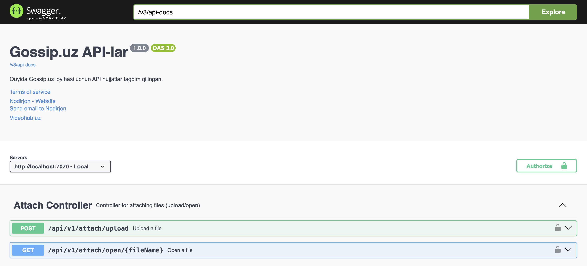
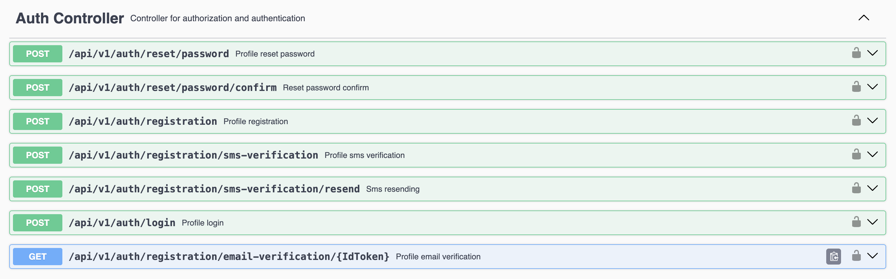
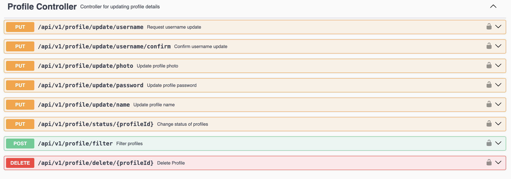
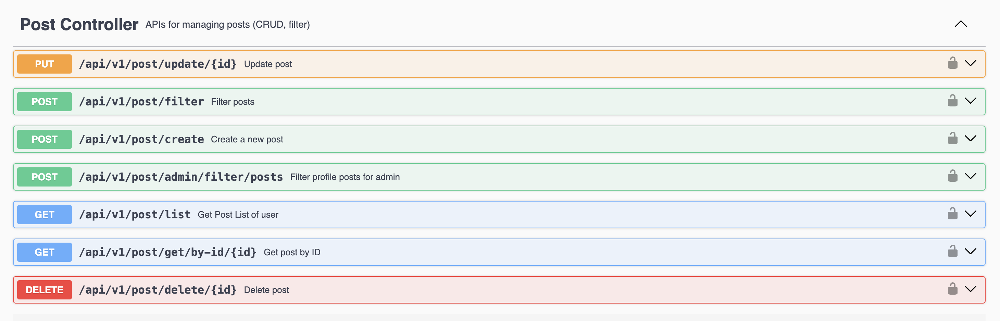
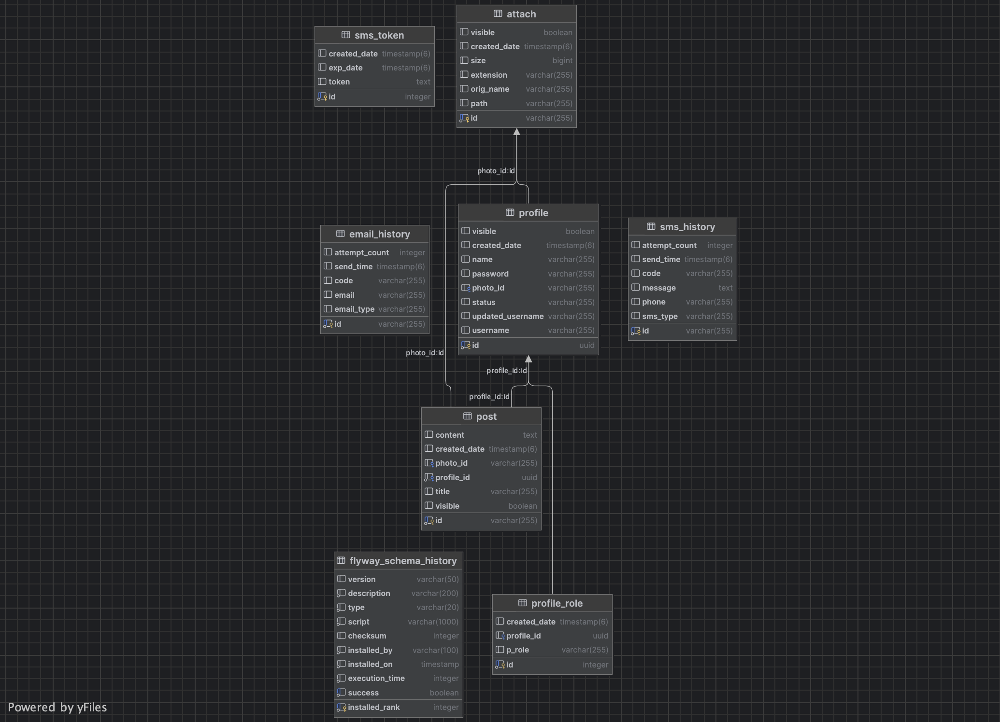

# Gossip Backend

  <!-- Add a backend screenshot here -->

## Overview
Gossip Backend is a RESTful API server that manages user registration, login, and posts. It is built using Spring Boot, Spring Security, and JWT authentication.

## Features
- User registration and login (JWT-based)
- CRUD operations for posts and profiles (Create, Read, Update, Delete)
- Role-based access control (Admin and User)
- Post filtering and pagination
- PostgreSQL database integration
- Email verification
- Phone verification

## Tech Stack
- Java 17
- Spring Boot
- Spring Security + JWT
- Spring Data JPA
- PostgreSQL
- Maven

## Swagger documentation





## Database Structure


### Tables
- **profile** – user information
- **roles** – user/admin roles
- **posts** – user posts
- **attach** – user profile photos
- Other necessary tables

## How to Run
1. Clone the repository:
- Update src/main/resources/application.properties with your DB username & password
```bash

git clone https://github.com/Bucky556/gossip-backend.git
